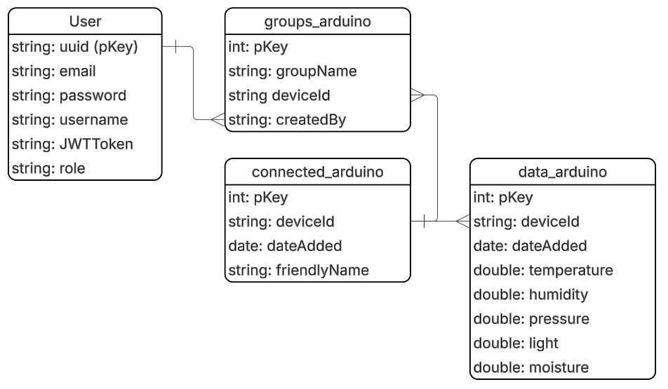

# Boardom API

<!-- Add your ER diagram here -->


> A .NET 8 Web API for managing IoT devices and sensor data with PostgreSQL — powering the [Boardom Dashboard](https://boardom-dashboard.mercantec.tech/).

[](https://dotnet.microsoft.com/)
[](https://www.postgresql.org/)
[](https://www.docker.com/)
[](https://dokploy.com/)

## About the Project

Boardom is a real-time household sensor monitoring system. The full project consists of two repositories:

| Repository | Description | URL |
| --- | --- | --- |
| **Backend** | API and database (this repo) | https://github.com/MathiasGermandsen/boardom-backend.git |
| **Frontend** | Blazor Server dashboard | https://github.com/MathiasGermandsen/boardom-frontend.git |

The frontend provides live device monitoring, analytics with historical charts, device and group management, and Auth0 authentication — all powered by this API.

---

## 📋 Table of Contents

- [Features](#-features)
- [Tech Stack](#-tech-stack)
- [Getting Started](#-getting-started)
- [API Endpoints](#-api-endpoints)
- [Background Jobs](#-background-jobs)
- [Configuration](#-configuration)
- [Docker](#-docker)
- [Project Structure](#-project-structure)

---

## ✨ Features

- **Device Management** - Register and manage IoT devices
- **Sensor Data Collection** - Store temperature, humidity, pressure, light, and moisture readings
- **Device Grouping** - Organize devices into logical groups
- **RESTful API** - Clean, well-documented API endpoints
- **Soft-Delete Cleanup Job** - Automatically purges soft-deleted devices and groups on a configurable schedule (default: every 30 days)
- **Swagger UI** - Interactive API documentation
- **Docker Support** - Containerized deployment ready
- **Dokploy Deployment** - Deploy via Dokploy

---

## 🛠 Tech Stack

| Technology              | Purpose               |
| ----------------------- | --------------------- |
| .NET 8                  | Web API Framework     |
| Entity Framework Core 8 | ORM / Database Access |
| PostgreSQL              | Database              |
| Npgsql                  | PostgreSQL Driver     |
| Swagger/OpenAPI         | API Documentation     |
| Docker                  | Containerization      |
| Dokploy                 | Deployment            |

---

## 🚀 Getting Started

### Prerequisites

- [.NET 8 SDK](https://dotnet.microsoft.com/download/dotnet/8.0)
- [PostgreSQL](https://www.postgresql.org/download/) (or Docker)
- [Docker](https://www.docker.com/) (optional)

### Installation

1. **Clone both repositories**
   ```bash
   git clone https://github.com/MathiasGermandsen/boardom-backend.git
   git clone https://github.com/MathiasGermandsen/boardom-frontend.git
   ```

2. **Configure the backend**

   Edit `boardomapi/appsettings.json` with the full configuration below. Replace the placeholder values with your own:

   ```json
   {
     "Logging": {
       "LogLevel": {
         "Default": "Information",
         "Microsoft.AspNetCore": "Warning",
         "Microsoft.EntityFrameworkCore": "Warning"
       }
     },
     "AllowedHosts": "*",
     "ConnectionStrings": {
       "DefaultConnection": "Host=<your-host>;Database=<your-db>;Username=<your-user>;Password=<your-password>;SSL Mode=Require;"
     },
     "CleanupJob": {
       "IntervalDays": 30,
       "IntervalMinutes": null
     }
   }
   ```

   | Key | Required | Description |
   | --- | :------: | --- |
   | `ConnectionStrings:DefaultConnection` | **Yes** | PostgreSQL connection string. The app will refuse to start without it. |
   | `CleanupJob:IntervalDays` | No | Days between soft-delete cleanup runs (default: `30`). |
   | `CleanupJob:IntervalMinutes` | No | Set to a number to override `IntervalDays` with a minutes-based interval. Useful for local testing. Set to `null` in production. |
   | `CORS_ORIGINS` | No | Comma-separated list of allowed CORS origins (e.g. `https://app.example.com,https://admin.example.com`). When not set, all origins are allowed. Can also be set as an environment variable. |

   > **Note:** In Development mode the app automatically applies pending EF Core migrations on startup. In Production you must run migrations manually.

3. **Run the backend**
   ```bash
   cd boardom-backend/boardomapi
   dotnet run
   ```

4. **Open Swagger UI**
   
   Navigate to: [http://localhost:5248/swagger](http://localhost:5248/swagger)

5. **Start the frontend** (optional)

   See the [frontend repository](https://github.com/MathiasGermandsen/boardom-frontend.git) for setup instructions. Once both stacks are running, the dashboard is available at `http://localhost:13000`.

---

## 📡 API Endpoints

### Device Controller

| Method | Endpoint             | Description                              |
| ------ | -------------------- | ---------------------------------------- |
| `POST` | `/Device/addDevice`  | Register a new device or update existing |
| `GET`  | `/Device/{deviceId}` | Get device details with sensor readings  |

**Add Device Request Body:**
```json
{
  "deviceId": "sensor-001",
  "friendlyName": "Living Room Sensor"
}
```

**Add Device Response (201 Created):**
```json
{
  "message": "Device registered",
  "deviceId": "sensor-001",
  "friendlyName": "Living Room Sensor"
}
```

**Get Device Response (200 OK):**
```json
{
  "deviceId": "sensor-001",
  "friendlyName": "Living Room Sensor",
  "createdAt": "2026-01-22T10:00:00Z",
  "sensorReadings": [
    {
      "pKey": 1,
      "deviceId": "sensor-001",
      "dateAdded": "2026-01-22T10:30:00Z",
      "temperature": 22.5,
      "humidity": 45.0,
      "pressure": 1013.25,
      "light": 500.0,
      "moisture": 30.0
    }
  ]
}
```

---

### Data Controller

| Method | Endpoint           | Description            |
| ------ | ------------------ | ---------------------- |
| `POST` | `/Data/sensorData` | Submit sensor readings |

**Request Body:**
```json
{
  "deviceId": "sensor-001",
  "temperature": 22.5,
  "humidity": 45.0,
  "pressure": 1013.25,
  "light": 500.0,
  "moisture": 30.0
}
```

**Response (201 Created):**
```json
{
  "message": "Sensor data recorded",
  "id": 1,
  "deviceId": "sensor-001",
  "dateAdded": "2026-01-22T10:30:00Z"
}
```

---

### Group Controller

| Method | Endpoint           | Description               |
| ------ | ------------------ | ------------------------- |
| `POST` | `/Group/create`    | Create a new device group |
| `PUT`  | `/Group/edit`      | Rename an existing group  |
| `POST` | `/Group/addDevice` | Add a device to a group   |

**Create Group:**
```json
{
  "groupName": "Kitchen Sensors"
}
```

**Edit Group:**
```json
{
  "groupName": "Kitchen Sensors",
  "newName": "Kitchen & Dining Sensors"
}
```

**Add Device to Group:**
```json
{
  "groupName": "Kitchen Sensors",
  "deviceId": "sensor-001"
}
```

---

## 🔄 Background Jobs

### Soft-Delete Cleanup Job

A background service (`SoftDeleteCleanupJob`) runs on a recurring schedule and permanently removes all `Device` and `Group` records where `IsDeleted` is `true`.

| Setting | Description | Default |
| --- | --- | --- |
| `CleanupJob:IntervalDays` | Interval in days between cleanup runs | `30` |
| `CleanupJob:IntervalMinutes` | Override interval in minutes (takes priority over `IntervalDays` when set) | `null` |

**How it works:**
1. The job starts when the application launches and waits for the configured interval.
2. After each interval it queries `Devices` and `Groups` with `IsDeleted == true` (bypassing the global query filter).
3. Matching records are permanently deleted from the database.
4. Results are logged — check the application logs for `SoftDeleteCleanupJob` entries.

**Configuration in `appsettings.json`:**
```json
{
  "CleanupJob": {
    "IntervalDays": 30,
    "IntervalMinutes": null
  }
}
```

**Testing locally:**

Set `IntervalMinutes` to a small value (e.g. `1`) to trigger the job quickly:
```json
{
  "CleanupJob": {
    "IntervalDays": 30,
    "IntervalMinutes": 1
  }
}
```
Remove `IntervalMinutes` (or set it to `null`) before deploying to production.

---

## ⚙️ Configuration

### Environment Variables

| Variable                               | Description                          | Default       |
| -------------------------------------- | ------------------------------------ | ------------- |
| `ConnectionStrings__DefaultConnection` | PostgreSQL connection string         | -             |
| `ASPNETCORE_ENVIRONMENT`               | Environment (Development/Production) | `Development` |
| `CleanupJob__IntervalDays`             | Days between soft-delete purge runs  | `30`          |
| `CleanupJob__IntervalMinutes`          | Minutes override (for testing)       | `null`        |

### appsettings.json

```json
{
  "Logging": {
    "LogLevel": {
      "Default": "Information",
      "Microsoft.AspNetCore": "Warning"
    }
  },
  "ConnectionStrings": {
    "DefaultConnection": "Host=localhost;Database=boardom;Username=postgres;Password=password"
  }
}
```

---

## 🐳 Docker

### Build the Image

```bash
cd boardomapi
docker build -t boardomapi:latest .
```

### Run with Docker

```bash
docker run -d \
  -p 8080:8080 \
  -e ConnectionStrings__DefaultConnection="Host=host.docker.internal;Database=boardom;Username=postgres;Password=password" \
  --name boardomapi \
  boardomapi:latest
```

### Docker Compose (with PostgreSQL)

```yaml
version: '3.8'
services:
  api:
    build: ./boardomapi
    ports:
      - "8080:8080"
    environment:
      - ConnectionStrings__DefaultConnection=Host=db;Database=boardom;Username=postgres;Password=password
    depends_on:
      - db

  db:
    image: postgres:16
    environment:
      - POSTGRES_DB=boardom
      - POSTGRES_USER=postgres
      - POSTGRES_PASSWORD=password
    volumes:
      - postgres_data:/var/lib/postgresql/data
    ports:
      - "5432:5432"

volumes:
  postgres_data:
```

---

## 📁 Project Structure

```
boardomapi/
├── .github/
│   └── copilot-instructions.md    # GitHub Copilot review guidelines
├── boardomapi/
│   ├── api/
│   │   ├── DataController/        # Sensor data endpoints
│   │   ├── DeviceController/      # Device management
│   │   └── GroupController/       # Group management
│   ├── database/
│   │   ├── AppDbContext.cs        # EF Core DbContext
│   │   └── DbConfig.cs            # Database configuration
│   ├── Jobs/
│   │   └── SoftDeleteCleanupJob.cs # Periodic soft-delete purge
│   ├── Models/
│   │   ├── Device.cs              # Device entity
│   │   ├── DeviceGroup.cs         # Device-Group relationship
│   │   ├── Group.cs               # Group entity
│   │   ├── Requests.cs            # API request records
│   │   └── SensorData.cs          # Sensor reading entity
│   ├── Program.cs                 # Application entry point
│   ├── Dockerfile                 # Container definition
│   └── appsettings.json           # Configuration
└── readme.md
```

---

## 📝 License

This project is licensed under the MIT License - see the [LICENSE](LICENSE) file for details.

---

## 🤝 Contributing

1. Fork the repository
2. Create a feature branch (`git checkout -b feature/amazing-feature`)
3. Commit your changes (`git commit -m 'feat: Add amazing feature'`)
4. Push to the branch (`git push origin feature/amazing-feature`)
5. Open a Pull Request

